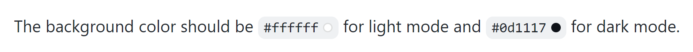
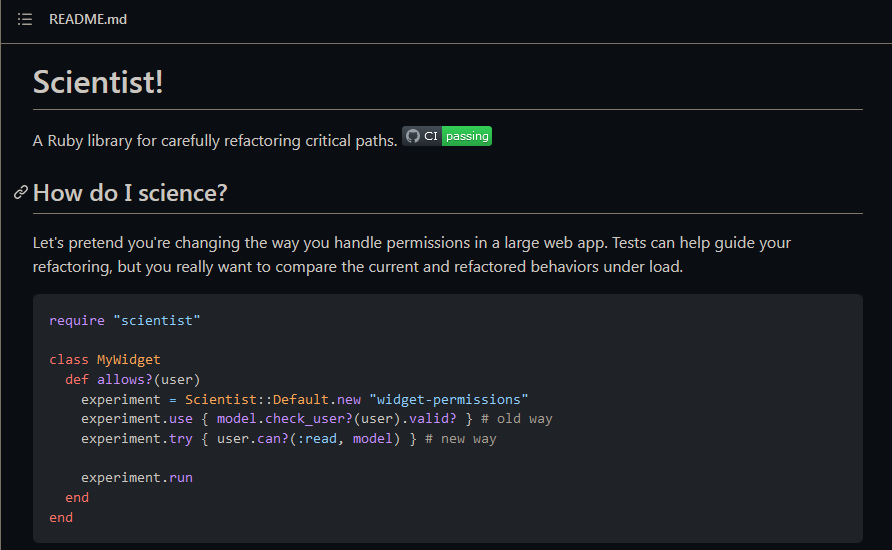
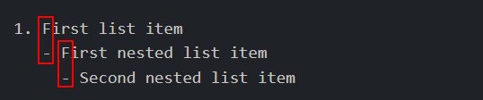

# Heading

```
# The largest heading
## The second largest heading
###### The smallest heading
```

# Styling text
You can indicate emphasis with bold, italic, strikethrough, subscript, or superscript text in comment fields and .md files.

|Style                  | Syntax            | Keyboard shortcut                               | Example                      | Output                     |
|-----------------------|-------------------|-------------------------------------------------|------------------------------|----------------------------|
|Bold              | `** **`or `__ __` | `Command` + `B` (Mac) or `Ctrl` + `B`(Windows/Linux) | `**This is bold text**`      | **This is bold text**      |
|Strikethrough     | `~~ ~~`           | `Command` + `I` (Mac) or `Ctrl` + `I`(Windows/Linux) | `~~This was mistaken text~~` | ~~This was mistaken text~~ |
|Bold and nested italic | `** **` and `_ _` |                            | `**This tex is _extremely_ important` | **This text is _extremely_ important** |
|All bold and italic    | `*** ***`         |                                      | `***All this text is important***` |***All this text is important*** |
|Subscript              | `<sub></sub>`     |                           | `<sub> This is a subscript text</sub>` | Hi<sub> This is a subscript text</sub> |
|Superscript            | `<sup></sup>`     |                         | `<sup>This is a superscript text</sup>` | Hi<sup>This is a superscript text</sup> |

# Quoting text
You can quote text with a `>`.

```
Text that is not a quote
> Text that is a quote
```
Text that is not a quote
> Text that is a quote

# Quoting code
You can call ou code or a command within a sentence with single backticks. The text within the backticks will not be formatted. You can also press `Command`+`E`(Mac) or `Ctrl`+`E`(Windows/Linux) keyboard shortcut to insert the backticks for a code block within a line of Markdown.

```
Use `git status` to list all new or modified files that haven't yet been committed.
```
Use `git status` to list all new or modified files that haven't yet been committed.

To format code or text into its own distinct block use triple backticks.
``````
Some basic Git commands are:
```
git status
git add
git commit
```
```````
Some basic Git commands are:
```
git status
git add
git commit
```

For more information, see "[Creating and highlighting code blocks](https://docs.github.com/en/get-started/writing-on-github/working-with-advanced-formatting/creating-and-highlighting-code-blocks)."

If you are frequently editing code snippets and tables, you may benefit from enablind a fixed-width font in all comment fields on Github. For more information, see "[Enabling fixed-width fonts in the editor](https://docs.github.com/en/github/writing-on-github/getting-started-with-writing-and-formatting-on-github/about-writing-and-formatting-on-github#enabling-fixed-width-fonts-in-the-editor)."

# Supported color models
In issues, pull requests, and discussions, you can call out colors within a sentence by using backticks. A supported color model within backticks will display a visualization of the color.

```
The background color should be `#ffffff` for light mode and `#0d1117` for dark mode.
```


Here are the currently supported color models.
| Color  | Syntsx             | Example                    | Output                                                 |
|--------|--------------------|----------------------------|--------------------------------------------------------|
|HEX     | `` `#RRGGBB` ``    | `` `#0969DA` ``            |  |
|RGB     | `` `rgb(R,G,B)` `` | `` `rgb(9, 105, 218)` ``   |  |
|HSL     | `` `hsl(H,S,L)` `` | `` `hsl(212, 92%, 45%)` `` |  |

Notes:
- A supperorted color model cannot have any leading or trailing spaces within the backticks.
- The visualization of the color is only supported in issues, pull requests, and discussions.

# Links
You can also create an inline link by wrapping link text in brackets `[ ]`, and then wrapping the URL in parentheses `(  )`. You can also use the keyboard shortcut `Command`+`K` to create a automatically create a link from selectioin.

You can also create a Markdown hyperlink by highlighting the text and using the keyboard shortcut `Command`+`V`. If you'd like to replace the text with the link, use the keyboard shortcut `Command`+`Shift`+`V`.

`This site was built using [GitHub Pages](https://pages.github.com/).`

This site was built using [GitHub Pages](https://pages.github.com/).

Tips: GitHub automatically creates links when valid URLs are written in a comment. For more information, see "[Autolinked references and URLs](https://docs.github.com/en/get-started/writing-on-github/working-with-advanced-formatting/autolinked-references-and-urls)."

# Section links
You can link directly to a section in a rendered file by hovering over the section heading to expose the link:

[How do I science?](https://github.com/github/scientist#how-do-i-science)



# Relative links
You can define relative links and image paths in your rendered files to help readers navigate to other files in your repository.

A relative link is a link that is relative to the current file. For example, if you have a README file in root of your repository, and you have another file in _docs/CONTRIBUTING.md_, the relative link to _CONTRIBUTING.md_ in your README might look like this:

```
[Contribution guidelines for this project](docs/CONTRIBUTING.md)
```
[Contribution guidelines for this project](docs/CONTRIBUTING.md)

GitHub will automatically transform your relative link or image path based on whatever branch you're currently on, so that the link or path always works. The path of the link will be relative to the current file. Links starting with `/` will be relative to the repository root. You can use all relative link operands, sucha as `./` and `../`.

Relative links are easier for users who clone your repository. Absolute links may not work in clones of your repository - we recommend using links to refer to other files within your repository.

For more information, see "[Relative Links](https://docs.github.com/en/get-started/writing-on-github/getting-started-with-writing-and-formatting-on-github/basic-writing-and-formatting-syntax#relative-links)".

# Specifying the theme an image is shown to
You can specify the theme an image is displayed for in Markdown by using the HTML `<picture>` element in combination with the `prefers-color-scheme` media feature. We distinguish between light and dar color modes, so there are two options availabel. You can use these options to display images optimized for dark or light backgrounds. This is particularly helpful for transparent PNG images.

For example, the following code displays a sun image for light themes and a moon for dark themes:
```
<picture>
 <source midia="(prefers-color-scheme: dark)" srcset="[https](https://user-images.githubusercontent.com/25423296/163456776-7f95b81a-f1ed-45f7-b7ab-8fa810d529fa.png)">
 <source midia="(prefers-color-scheme: light)" srcset="[https](https://user-images.githubusercontent.com/25423296/163456779-a8556205-d0a5-45e2-ac17-42d089e3c3f8.png)">
 
</picture>
```

The old method of specifying images based on the theme, by using a fragment appended to the URL(`#gh-dark-mode-only` or `#gh-light-mode-only`), is deprecated and will be removed in favor of the new method described above.

## Nested Lists
You can create a nested list by indenting one or more list items below another item.

To create a nested list using the web editor on GitHub or a text editro that uses a monospaced font, like Visual Studio Code, you can align your list visually. Type space characters in front of your nested list item, until the list marker character (`-`or`*`) lies directly below the first character of the text in the item above it.
```
1. First list item
   - First nested list item
     - Second nested list item
```

Note: In the web-based editor, you can indent ot dedent one or more lines of text first highlighting the desired lines and then suing `Tab` or `Shift`+`Tab` respectively.

1. First list item
   - First nested list item
     - Second nested list item
