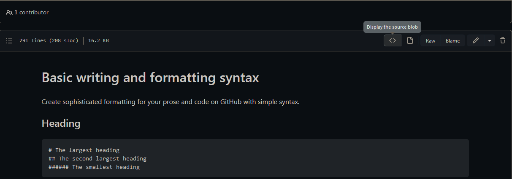

# Basic writing and formatting syntax
Create sophisticated formatting for your prose and code on GitHub with simple syntax.

## Heading

```
# The largest heading
## The second largest heading
###### The smallest heading
```

## Styling text
You can indicate emphasis with bold, italic, strikethrough, subscript, or superscript text in comment fields and .md files.

|Style                  | Syntax            | Keyboard shortcut                               | Example                      | Output                     |
|-----------------------|-------------------|-------------------------------------------------|------------------------------|----------------------------|
|Bold              | `** **`or `__ __` | `Command` + `B` (Mac) or `Ctrl` + `B`(Windows/Linux) | `**This is bold text**`      | **This is bold text**      |
|Strikethrough     | `~~ ~~`           | `Command` + `I` (Mac) or `Ctrl` + `I`(Windows/Linux) | `~~This was mistaken text~~` | ~~This was mistaken text~~ |
|Bold and nested italic | `** **` and `_ _` |                            | `**This tex is _extremely_ important` | **This text is _extremely_ important** |
|All bold and italic    | `*** ***`         |                                      | `***All this text is important***` |***All this text is important*** |
|Subscript              | `<sub></sub>`     |                           | `<sub> This is a subscript text</sub>` | Hi<sub> This is a subscript text</sub> |
|Superscript            | `<sup></sup>`     |                         | `<sup>This is a superscript text</sup>` | Hi<sup>This is a superscript text</sup> |

## Quoting text
You can quote text with a `>`.

```
Text that is not a quote
> Text that is a quote
```
Text that is not a quote
> Text that is a quote

## Quoting code
You can call ou code or a command within a sentence with single backticks. The text within the backticks will not be formatted. You can also press `Command`+`E`(Mac) or `Ctrl`+`E`(Windows/Linux) keyboard shortcut to insert the backticks for a code block within a line of Markdown.

```
Use `git status` to list all new or modified files that haven't yet been committed.
```
Use `git status` to list all new or modified files that haven't yet been committed.

To format code or text into its own distinct block use triple backticks.
``````
Some basic Git commands are:
```
git status
git add
git commit
```
```````
Some basic Git commands are:
```
git status
git add
git commit
```

For more information, see "[Creating and highlighting code blocks](https://docs.github.com/en/get-started/writing-on-github/working-with-advanced-formatting/creating-and-highlighting-code-blocks)."

If you are frequently editing code snippets and tables, you may benefit from enablind a fixed-width font in all comment fields on Github. For more information, see "[Enabling fixed-width fonts in the editor](https://docs.github.com/en/github/writing-on-github/getting-started-with-writing-and-formatting-on-github/about-writing-and-formatting-on-github#enabling-fixed-width-fonts-in-the-editor)."

## Supported color models
In issues, pull requests, and discussions, you can call out colors within a sentence by using backticks. A supported color model within backticks will display a visualization of the color.

```
The background color should be `#ffffff` for light mode and `#0d1117` for dark mode.
```


Here are the currently supported color models.
| Color  | Syntsx             | Example                    | Output                                                 |
|--------|--------------------|----------------------------|--------------------------------------------------------|
|HEX     | `` `#RRGGBB` ``    | `` `#0969DA` ``            |  |
|RGB     | `` `rgb(R,G,B)` `` | `` `rgb(9, 105, 218)` ``   |  |
|HSL     | `` `hsl(H,S,L)` `` | `` `hsl(212, 92%, 45%)` `` |  |

Notes:
- A supperorted color model cannot have any leading or trailing spaces within the backticks.
- The visualization of the color is only supported in issues, pull requests, and discussions.

## Links
You can also create an inline link by wrapping link text in brackets `[ ]`, and then wrapping the URL in parentheses `(  )`. You can also use the keyboard shortcut `Command`+`K` to create a automatically create a link from selectioin.

You can also create a Markdown hyperlink by highlighting the text and using the keyboard shortcut `Command`+`V`. If you'd like to replace the text with the link, use the keyboard shortcut `Command`+`Shift`+`V`.

`This site was built using [GitHub Pages](https://pages.github.com/).`

This site was built using [GitHub Pages](https://pages.github.com/).

Tips: GitHub automatically creates links when valid URLs are written in a comment. For more information, see "[Autolinked references and URLs](https://docs.github.com/en/get-started/writing-on-github/working-with-advanced-formatting/autolinked-references-and-urls)."

## Section links
You can link directly to a section in a rendered file by hovering over the section heading to expose the link:

[How do I science?](https://github.com/github/scientist#how-do-i-science)


## Relative links
You can define relative links and image paths in your rendered files to help readers navigate to other files in your repository.

A relative link is a link that is relative to the current file. For example, if you have a README file in root of your repository, and you have another file in _docs/CONTRIBUTING.md_, the relative link to _CONTRIBUTING.md_ in your README might look like this:

```
[Contribution guidelines for this project](docs/CONTRIBUTING.md)
```
[Contribution guidelines for this project](docs/CONTRIBUTING.md)

GitHub will automatically transform your relative link or image path based on whatever branch you're currently on, so that the link or path always works. The path of the link will be relative to the current file. Links starting with `/` will be relative to the repository root. You can use all relative link operands, sucha as `./` and `../`.

Relative links are easier for users who clone your repository. Absolute links may not work in clones of your repository - we recommend using links to refer to other files within your repository.

For more information, see "[Relative Links](https://docs.github.com/en/get-started/writing-on-github/getting-started-with-writing-and-formatting-on-github/basic-writing-and-formatting-syntax#relative-links)".

## Specifying the theme an image is shown to
You can specify the theme an image is displayed for in Markdown by using the HTML `<picture>` element in combination with the `prefers-color-scheme` media feature. We distinguish between light and dar color modes, so there are two options availabel. You can use these options to display images optimized for dark or light backgrounds. This is particularly helpful for transparent PNG images.

For example, the following code displays a sun image for light themes and a moon for dark themes:
```
<picture>
 <source midia="(prefers-color-scheme: dark)" srcset="[https](https://user-images.githubusercontent.com/25423296/163456776-7f95b81a-f1ed-45f7-b7ab-8fa810d529fa.png)">
 <source midia="(prefers-color-scheme: light)" srcset="[https](https://user-images.githubusercontent.com/25423296/163456779-a8556205-d0a5-45e2-ac17-42d089e3c3f8.png)">
 
</picture>
```

The old method of specifying images based on the theme, by using a fragment appended to the URL(`#gh-dark-mode-only` or `#gh-light-mode-only`), is deprecated and will be removed in favor of the new method described above.

## Lists
You can make an unordered list by preceding one or more lines of text with `-`, `*`, or `+`.
```
- George Washington
* John Adams
+ Thomas Jefferson
```
- George Washington
* John Adams
+ Thomas Jefferson

To order your list, precede each line with a number.
```
1. James Madison
2. James Monroe
3. John Quincy Adams
```
1. James Madison
2. James Monroe
3. John Quincy Adams

## Nested Lists
You can create a nested list by indenting one or more list items below another item.

To create a nested list using the web editor on GitHub or a text editro that uses a monospaced font, like [Visual Studio Code](https://code.visualstudio.com/), you can align your list visually. Type space characters in front of your nested list item, until the list marker character (`-`or`*`) lies directly below the first character of the text in the item above it.
```
1. First list item
   - First nested list item
     - Second nested list item
```

Note: In the web-based editor, you can indent ot dedent one or more lines of text first highlighting the desired lines and then suing `Tab` or `Shift`+`Tab` respectively.


1. First list item
   - First nested list item
     - Second nested list item

To create a nested list in the comment editor on GitHbu, which doesn't use a monospaced font, you can look at the list item immediately above the nested list and count the number of characters that appear before the content of the item. Then type that number of space characters in front of the nested list item.

In this example, you could add a nested list item under the list item `100. First list item` by indenting the nested list item a minimum of five spaces, since there are five characters(`100. `) before `First list item`.
```
100. First list item
     - First nested list item
```
100. First list item
     - First nested list item

For more examples, see the [GitHub Flavored Markdown Spec](https://github.github.com/gfm/#example-265).

## Task lists
To create a task list, preface list items a hyphen and space followed by `[ ]`. To mark a task as complete, use `[x]`.
```
- [x] #739
- [ ] https://github.com/octo-org/octo-repo/issues/740
- [ ] Add delight to the experience when all tasks are complete :tada:
```
- [x] #739
- [ ] https://github.com/octo-org/octo-repo/issues/740
- [ ] Add delight to the experience when all tasks are complete :tada:

If a task list item description begins with a parenthesis, you'll need to escape it with \``:

`- [] \(Optional) Open a followup issue`

For more information, see "[About task lists](https://docs.github.com/en/get-started/writing-on-github/working-with-advanced-formatting/about-task-lists)".

## Mentioning people and teams
You can mention a person or [team](https://docs.github.com/en/organizations/organizing-members-into-teams) on GitHub by typing `@` plus their username or team name. This will trigger a notification and bring their attention to the conversation. People will also receive a notification if you edit a comment to mention their username or team name. For more information about notification, see "[About notification](https://docs.github.com/en/account-and-profile/managing-subscriptions-and-notifications-on-github/setting-up-notifications/about-notifications)".

Note: A person will only be notified about a mention if the person has read access to the repository and, if the repository is owned by an organization, the person is a member of the organization.

`@github/support What do you think about these updates`

@github/support What do you whink about these updates?

When you mention a parent team, members of its child teams also receive notifications, simplifying communication with multiple groups of people. For more information, see "[About teams](https://docs.github.com/en/organizations/organizing-members-into-teams/about-teams)".

Typing an `@` symbol will bring up a list of people or teams on a project. The list filters as you type, so once you find the name of the person or team you are looking for, you can use the arrow keys to select it and press either tab or enter to complete the name. For teams, enter the @organization/team-name and all members of that team will get subscribed to the conversation.

The autocomplete results are restricted to repository collaborators and any other participants on the thread.

## REferencing issues and pull requests
You can bring up a list of suggested issues and pull requests within the repository by typing `#`. Type the issue or pull request number or title to filter the list, and then press either tab or enter to complete the highlighted result.

For more information, see "[Autolinked references and URLs](https://docs.github.com/en/get-started/writing-on-github/working-with-advanced-formatting/autolinked-references-and-urls)".

## Referencing external resources
If custom autolink references are configured for a repository, then references to external resources, like a JIRA or Zendesk ticket, convert into shortened links. To know which autolinks are available in your repository, contact someone with admin permissions to the repository. For more information, see "[Configuring autolinks to reference external resources](https://docs.github.com/en/repositories/managing-your-repositorys-settings-and-features/managing-repository-settings/configuring-autolinks-to-reference-external-resources)".

## Uploading assets
You can upload assets like images by dragging and dropping, selecting from a file brower, or pasting. You can upload assets to issues, pull requests, comments, and `.md` files in your repository.

## Using emoji
You can add emoji to your writing by typing `:EMOJICODE:`.

`@octocat :+1: This is PR looks greate - it's ready to merge! :shipit:`

@octocat 👍 This is PR looks greate - it's ready to merge! :shipit:

Typing `:` will bring up a list of suggested emoji. The list will filter as you type, so once you find the emoji you're looking for, press **Tab** or **Enter** to complete the highlighted result.

For a full list of available emoji and codes, check out [the Emoji-Cheat-Sheet](https://github.com/ikatyang/emoji-cheat-sheet/blob/master/README.md).

## Paragraphs
You can create a new paragraph by leaving a blank line between lines of text.

## Footnotes
You can add footnotes to your content by using this bracket syntax:

```
Here is a simple footnote[^1].

A footnote can also have multiple lines[^2].

You can also use words, to fit your writing style more closely[^note].

[^1]: My reference.
[^2]: Every new line should be prefixed with 2 spaces.
  This allows you to have a footnote with multiple lines.
[^note]:
    Named footnotes will still render with numbes instead of the text but allow easier identification and linking.
    This footnote also has been made with a different syntax using 4 spaces for new lines.
```

The foonote wiil render like this:

Here is a simple footnote[^1].

A footnote can also have multiple lines[^2].

You can also use words, to fit your writing style more closely[^note].

[^1]: My reference.
[^2]: Every new line should be prefixed with 2 spaces.
  This allows you to have a footnote with multiple lines.
[^note]:
    Named footnotes will still render with numbes instead of the text but allow easier identification and linking.
    This footnote also has been made with a different syntax using 4 spaces for new lines.
    
Note: The position of a footnote in your Markdown does not influence where the footnote will be rendered. You can write a footnote right after your reference to the footnote, and the footnote will still render at the bottom of the Markdown.

Footnotes are not supported in wikis.

## Hiding content with comments
You can tell GitHub to hide content from the rendered Markdown by placing the content in an HTML comment.

`<!-- This content will not appear in the rendered Markdown -->`

## Ignoring Markdown formatting
You can tell GitHbu to ignore (or escape) Markdown formatting by using `\` before the Markdown character.

`Let's rename \*our-new-project\* to \*our-old-project\*`

Let's rename \*our-new-project\* to \*our-old-project\*

For more information, see Daring Fireball's "[Markdown Syntax](https://daringfireball.net/projects/markdown/syntax#backslash)".

## Diabling Markdown rendering 
When viewing a Markdown file, you can click <> at the top of the file to disable Markdown rendering and view the file's source instead.



Disabling Markdown rendering enables you to use source view features, such as line linking, which is not possible when viewing rendered Markdwon files.

## Further reading
- [GitHub Flavored Markdown Spec](https://github.github.com/gfm/)
- "[About writing and formatting on GitHub](https://docs.github.com/en/get-started/writing-on-github/getting-started-with-writing-and-formatting-on-github/about-writing-and-formatting-on-github)"
- "[Working with advanced formatting](https://docs.github.com/en/get-started/writing-on-github/working-with-advanced-formatting)"
- "[Quickstart for writing on GitHub](https://docs.github.com/en/get-started/writing-on-github/getting-started-with-writing-and-formatting-on-github/quickstart-for-writing-on-github)"
